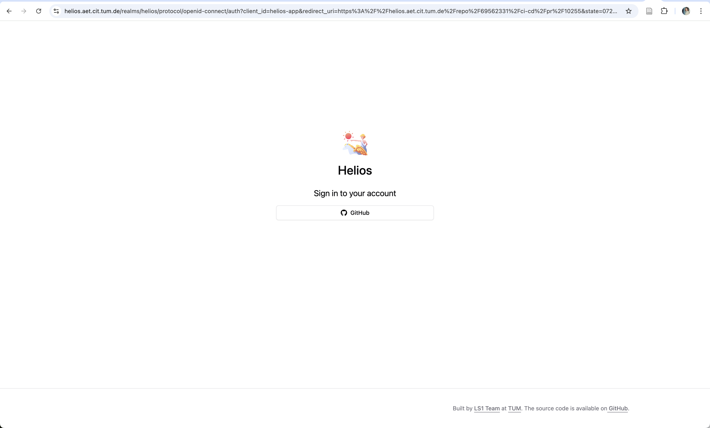
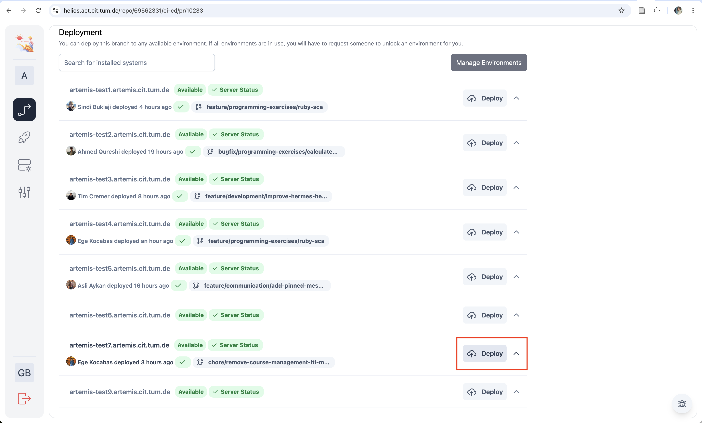

=================
Helios User Guide
=================

Overview
--------
Helios is a deployment management tool that simplifies the process of deploying pull requests and branches to test environments. This guide walks you through the basic deployment workflow.

Prerequisites
--------------
- GitHub account with access to the repository
- Proper permissions to deploy
- Available test environment

Deployment Workflow
--------------------

1. Repository Selection
~~~~~~~~~~~~~~~~~~~~~~~~
Select the repository you want to deploy from the main dashboard.

.. figure:: ../../images/user_guide/1-select-repo.png
   :height: 512px
   :alt: Repository selection screen
   

2. Authentication
~~~~~~~~~~~~~~~~~~
Log in with your GitHub credentials.

.. figure:: ../../images/user_guide/2-login.png
   :height: 512px
   :alt: Login with GitHub
   
   

   

3. Pull Request Selection
~~~~~~~~~~~~~~~~~~~~~~~~~~
Choose the pull request or branch you want to deploy.

.. figure:: ../../images/user_guide/4-open-pr.png
   :height: 512px
   :alt: Pull request details screen
   

4. Deployment Initiation
~~~~~~~~~~~~~~~~~~~~~~~~~
Click the deploy button to start the deployment process.

   

The deployment enters a pending state while resources are being allocated.

.. figure:: ../../images/user_guide/6-deployment-pending.png
   :height: 512px
   :alt: Deployment pending status

The deployment moves to the in-progress state during active deployment.

.. figure:: ../../images/user_guide/7-deployment-in-progress.png
   :height: 512px
   :alt: Deployment progress status

5. Unlock the test environment once you finish testing.
~~~~~~~~~~~~~~~~~~~~~~~~~~~~~~~~~~~~~~~~~~~~~~~~~~~~~~~~~~

.. figure:: ../../images/user_guide/8-unlock.png
   :height: 512px
   :alt: Unlock test environment

Troubleshooting
----------------

Manual Deployment Fallback
~~~~~~~~~~~~~~~~~~~~~~~~~~~~
⚠️ **Warning**: Manual workflow deployment should be used only as a last resort as it may conflict with Helios environment locking.

If Helios deployment fails, you can use the GitHub workflow as a fallback:

Access the workflow at:
   https://github.com/ls1intum/Artemis/actions/workflows/testserver-deployment.yml

.. figure:: ../../images/user_guide/github-deployment.png
   :height: 512px
   :alt: GitHub deployment workflow

Required Inputs
*****************
- **Use workflow from**: Select your target branch
- **Which branch to deploy**: Again, select your target branch
- **Which environment to deploy**: Use format ``artemis-test7.artemis.cit.tum.de``
- **Username** (optional): Your GitHub username

Support
-------
For assistance:

- Join the Helios Support Slack channel https://ls1tum.slack.com/archives/C08BPLNT8FL
- Report a new issue if you encounter a bug or need help https://github.com/ls1intum/Helios/issues/new/choose